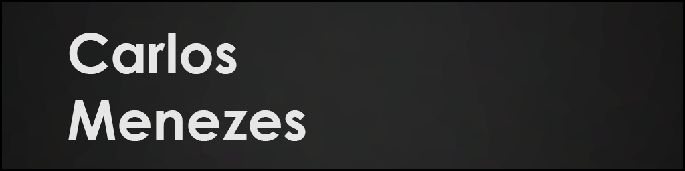

<h1> INFO </h1>

A game's lover. I have always known my future would be 100% related to games, but it is a dream coming true that I can make part of their development.

My name is Carlos Menezes Concencio, I love games and I got into the world of gaming development around 2017 when I moved away from my hometown to start studying on the other side of the country. In the beginning I was afraid of this world I was discovering under the games that I have always played, I thought it would be too hard, but today I feel like it really changed the way I see every single action in games. Every event, every effect, every animation. Each one of these little things that are part of creating a game makes me want to be a part of it even more.

#### Need help for any games related charity project? Contact me and I'll do my best to help you!
#### Temporary and under development [Portfolio](carlosmenezeswix.wixsite.com/portfolio) 

<ul>
  <li>Unity Engine - Intermediate</li>
</ul>
<ul>
	<ul>
		<li> PC and Mobiles personal projects experience</li>
		<li> Good understanding of smart ads systems for mobiles</li>
		<li> Solid understanding of Unity Engine libraries</li>
    		<li> Multiple licensed assets published on <a href="https://assetstore.unity.com/publishers/37008">Unity Asset Store</a></li>
		<li> Basic understanding of raw multiplayer code. Non-profit 3D Among Us game under developing for research purposes</li>
		<li> Unity's Physics System - Intermediate</li>
		<li> User Interface - Intermediate</li>
		<li> Custom Unity Editors - Intermediate</li>
		<li> Shuriken Particle System - Intermediate</li>
		<li> Built In Shaders - Basic</li>	
  	</ul>
</ul>

<ul>
  <li>C# Development - Intermediate</li>
</ul>
<ul>
	<ul>
		<li> Solid OOP principles and design patterns</li>
		<li> Working with Unity Engine since 2017</li>
    		<li> <a href="https://carlosmenezeswix.wixsite.com/portfolio/applications">Windows Forms applications</a> for personal use</li>
  </ul>
</ul>

<ul>
  <li>C and C++ Development - Basic</li>
</ul>

<ul>
  <li>Python Development - Basic</li>
</ul>

<ul>
  <li><a href="https://carlosmenezeswix.wixsite.com/portfolio/3d-models">Blender 3D Modeling</a> - Intermediate</li>
</ul>

#### Useful links:

[ Assets Store](https://assetstore.unity.com/publishers/37008) 
 
[ LinkedIn](https://www.linkedin.com/in/carlosmconcencio/)

